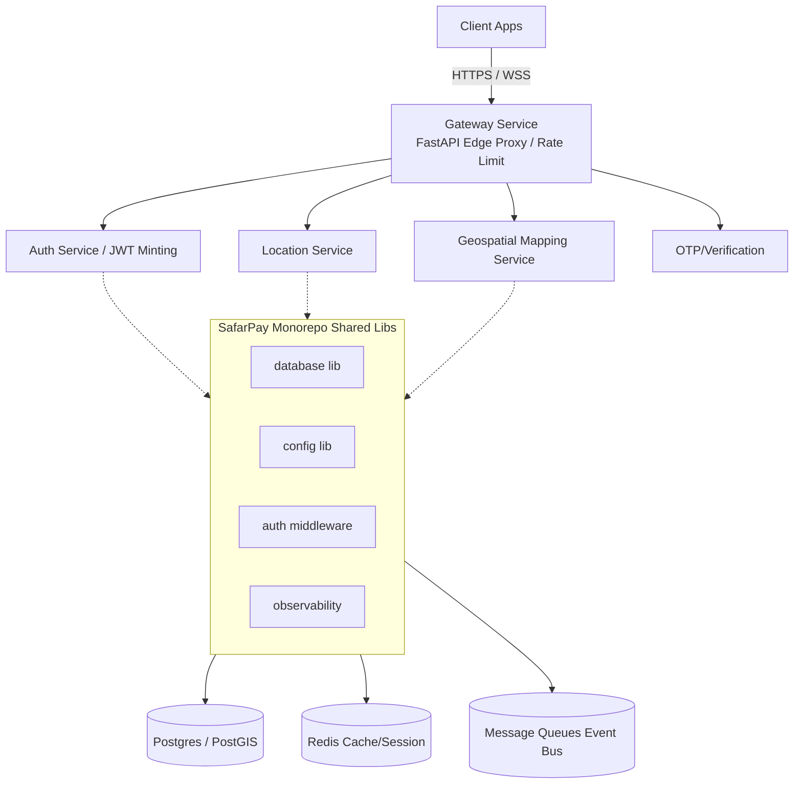

# SafarPay Monorepo Deep Architecture Audit
> **Date**: April 20, 2026
> **Scope**: `SafarPay` Monorepo (`services/`, `libs/`, Root Configuration)

Based on a deep-dive technical assessment of your FastAPI architecture, database layers, shared `libs/`, and microservice scaffolding, here is the end-to-end audit. I've noted several severe architectural misconfigurations and data-integrity risks that need immediate rectifying before moving toward production or building further abstractions.

---

## 🚨 1. Critical Issues (Must Fix Immediately)

### A. Missing FastAPI Application Entrypoints
Your monorepo scaffolding is completely missing actual web and ASGI initialization layers. 
- The `main.py` files in `gateway`, `auth`, and the root directory consist merely of bare boilerplate scripts (e.g., `def main(): print("Hello from auth!")`). 
- **Impact**: Services are currently completely unmountable and unrunnable. Your `routes.py` files declare `APIRouter()` objects, but there is no `FastAPI()` core instance wrapping them, nor `uvicorn` runners.

### B. Severe Data Integrity Risk in Database Session Manager
In `libs/database/src/database/engine.py`, your DI generator arbitrarily commits **all** downstream database writes upon successful yield generation:
```python
async def get_async_session() -> AsyncGenerator[AsyncSession, None]:
    async with async_session_factory() as session:
        try:
            yield session
            await session.commit()  # <--- CRITICAL BUG ⚠️
```
- **Impact**: You strip the business logic in the API path of the capability to dictate atomic boundaries. If a service generates a partial/dirty write but does not throw a Python Exception (e.g., aborts functionally, returns a 400 manually, or does a dry-run check), `get_async_session` blindly commits the corrupt transaction fragment to Postgres.

### C. Leaking Database Connection Pools
Inside `libs/database/src/database/engine.py`, the `AsyncSessionManager` class dynamically invokes `create_db_engine()` every time a class object is instantiated:
```python
class AsyncSessionManager:
    def __init__(self):
        self._engine = create_db_engine() # <--- BUG: Creates a new isolated pool on every call
```
- **Impact**: Postgres will quickly hit `FATAL: sorry, too many clients already`. You bypass built-in SQLAlchemy pooling completely.

### D. Critical Identity & Authorization Misuse
In `services/auth/routes/routes.py` and `services/gateway/routes/routes.py`, `Depends(verify_token)` is utilized on the controller inputs:
```python
token: str = Depends(verify_token)
```
- **Impact**: Since `verify_token` is typed as `(token: str)`, FastAPI maps this implicitly to a **Query Parameter** instead of a standardized HTTP Auth header. Any client must submit their highly sensitive tokens natively via `/users/me?token=...`, exposing bearer tokens continuously to raw network logs, browser histories, and edge traces.

### E. Broken AsyncSession Context Managers
In practically every microservice (e.g., `services/auth/db/db.py`), your DB dependency contains synchronous generators wrapping async objects:
```python
def get_db():
    db = SessionLocal()  # <--- Evaluated as an AsyncSession coroutine
    try:
        yield db
    finally:
        db.close()       # <--- Sync crash!
```
- **Impact**: FastApi instantly errors out with `AttributeError: 'coroutine' object has no attribute 'close'`. You cannot synchronously yield and close an asynchronous `AsyncSession`. It must use `async def get_db()` and `await db.close()`.

### F. Missing Shared Libraries & Fatal ImportErrors
Your services (e.g., `services/*/db/redis.py`) are calling:
```python
from database.redis import create_redis_client
```
- **Impact**: The method `create_redis_client` does NOT exist in `database.redis` (`redis.py` only defines `RedisManager`). The entire application instantly dies with an `ImportError`. Additionally, files try to `from database.db import create_db_engine` but the paths don't align with the UV workspace structural exports cleanly in all microservices.

### G. Unhandled Kafka Dependencies & Logic Errors
In `libs/messaging/src/messaging/kafka.py`:
```python
value_serializer=lambda v: json.dumps(v).encode("utf-8")
```
- **Impact**: You execute a lambda relying on `json`, but `import json` is NEVER declared at the top of the `kafka.py` script. The second any message is published, `KafkaProducer` inherently triggers a FATAL `NameError`.

### H. Session Engine Evaluated at Import Time
In `libs/database/src/database/engine.py`, your session factory triggers `create_db_engine()` globally during module import time:
```python
async_session_factory = async_sessionmaker(create_db_engine())
```
- **Impact**: You cannot control the database lifecycle cleanly, it heavily blocks proper unit testing (by preventing easy engine mocking), and spawns eager connections prematurely during framework python loads rather than respecting standard ASGI `lifespan` blocks.

---

## 🟧 2. High Priority Issues

### A. Non-Cached Pydantic Setting Executions
In `libs/config/src/config/settings.py` and across your library, `get_settings()` returns a fresh instantiation of Pydantic (`Settings()`).
- **Impact**: Pydantic parses schemas and OS environments (I/O) dynamically on every evaluation dynamically. Injected configuration across many API calls causes immense CPU overhead and garbage collection blocking. Pydantic settings **must** be memoized using `@functools.lru_cache()`.

### B. Broken Recursive Import Scopes
`libs/auth/src/auth/jwt.py` has a critical parsing conflict at `line 81`:
```python
def get_auth_settings():
    from .config import Settings
    return Settings()
```
- **Impact**: The `.config` module defines `AuthSettings`, not `Settings`, meaning calling `get_auth_settings` throws a raw `ImportError` crashing the `jwt.py` logic natively.

### C. Rate Limit Memory Bomb
In `services/gateway/routes/routes.py`, gateway rate limiting evaluates a Python Dict list comprehension (`[req_time for req_time in _rate_limits[client_id] if now - req_time < 60]`) asynchronously. 
- **Impact**: It operates on an unbounded memory store inside a dictionary (`_rate_limits = {}`). List comprehensions on expanding objects inside global memory leak continuously and synchronously block the primary `asyncio` event loop thread per request payload.

### D. Missing Migration Mechanism
The repository lacks structured SQLAlchemy transitions (no `alembic` installation or `alembic.ini` metadata folder mappings).

### E. Fundamentally Flawed Prometheus Histograms
In `libs/observability/src/observability/metrics.py`, your Prometheus histogram exposer calculates raw averages (`sum(values) / len(values)`) instead of standard dimensional partition buckets (`_bucket`, `_sum`, `_count`). 
- **Impact**: You completely break Prometheus visualization metrics. PromQL `histogram_quantile` functions will inherently fail against standard aggregations.

### F. Global Redis Instantiation Timing
In `libs/cache/src/cache/manager.py`, `.from_url` is invoked directly referencing `settings.REDIS_URL` behind a global `cache = CacheManager()` object without managing async-friendly lifespans cleanly.

### G. Architectural Inconsistency in Config Sources
While you have correctly created a centralized `libs/config`, individual library folders (`libs/auth/config.py`, `libs/messaging/config.py`, etc.) are actively establishing fragmented Pydantic settings environments.
- **Impact**: Environment parsing diverges, creating massive boilerplate drift throughout microservices and breaking the "Single Source of Truth" pipeline necessary for twelve-factor scaling implementations.

### H. CacheManager Context `settings` NameError
In `libs/cache/src/cache/manager.py`, the `_get_redis` initialization tries to invoke `.from_url(settings.REDIS_URL)`, but `settings` is undeclared inherently in the method scope (it should be `self._settings`). 
- **Impact**: Any invocation of standard caching instantly crashes parsing with a `NameError`.

### I. Messaging Kafka blocking async loops
In `libs/messaging/src/messaging/kafka.py`, your async producer inherently executes a synchronous `.get(timeout=10)` block pipeline:
```python
async def send():
    future = self._producer.send(...)
    result = future.get(timeout=10) # <--- Blocking
```
- **Impact**: This fundamentally freezes FastAPI's async execution paradigm. Using synchronous `.get` inside an ASGI thread will freeze the event loop heavily. Utilizing `asyncio.to_thread` or adopting the native `aiokafka` client wraps this safely.

### J. Service Layer Domain Duplication
Every microservice (e.g., `gateway`, `location`) replicates boilerplate infrastructure folders (`db/`, `env.py`, `models/`).
- **Impact**: Service layers should strictly restrict themselves to `routes/`, `domain/`, and `main.py`, pulling persistent layers entirely from the shared SDK. Building duplicative models and db loaders breaks DRY monorepo logic continuously.

---

## 🟨 3. Medium Priority Improvements

- **Global Error Handling Framework**: `libs.observability` implements custom JSON logging but lacks a native mapping to FastAPI's `ExceptionHandlers`. 422 Unprocessable Entities and 500 Internals will fall back to default Uvicorn unoptimized plaintext rather than uniform json payloads wrapped securely.
- **Typed User Tokens**: `decode_token` blindly trusts standard `Dict[str, Any]` mapping. The API should enforce `Pydantic` casting directly on token contents to guarantee expected typing formats cleanly (like `.user_id`) without runtime `KeyError` risks.
- **Microservice Redundancy vs Root Dependency**: The root `pyproject.toml` is mixing heavy overlapping arrays under its custom standard `[dependency-groups]`. Rely strictly on standard UV package locks mapped strictly down to single isolated `services/*/pyproject.toml` lists to ensure predictable layering.

- **Gateway Abstraction Density**: The Gateway currently proxies blindly without intelligent Service Discovery layers, circuit breakers, or centralized routing maps. An effective API Gateway needs load balancing, structured timeout enforcement, and retry policies via client layers.
- **Observability Missing Trace Horizons**: Although JSON logging is successfully piped, OpenTelemetry distributed tracing ID frameworks between inter-microservice jumps remain absent.
- **Messaging Pipeline Missing Schemas**: The Event Bus lacks a native Schema Registry (e.g., protobuf formatting definitions) and fallback Dead Letter Queue (DLQ) retry architectures.

---

## 🟦 4. Low Priority / Code Quality Suggestions

- Adopt native `Lifespan` ASGI functions. Remove global state management via global dictionaries/lists and explicitly open and tear down PostgreSQL/Redis objects when the FastAPI application spins up.
- Migrate away from `passlib[bcrypt]`. `Passlib` is effectively abandoned at standard library limits (no active commits in 3 years). Recommend `bcrypt` direct or `argon2-cffi`. 
- `services/gateway/env.py` has an orphaned `BaseSettings` object using `.dotenv` loads but nothing handles it. Clean up boilerplate logic.

---

## 🏗️ 5. Architecture Diagram



---

## 📂 6. Recommended Folder Structure

A standardized UV workspace structure enforcing strict boundaries:

```text
SafarPay/
├── pyproject.toml
├── uv.lock
├── libs/
│   ├── database/
│   │   ├── pyproject.toml
│   │   └── src/database/
│   │       ├── __init__.py
│   │       ├── core.py      # Engines, AsyncSession
│   │       ├── models.py    # Master declarative base & mixins
│   │       └── redis.py
│   ├── config/
│   └── auth/
├── services/
│   ├── gateway/
│   │   ├── pyproject.toml
│   │   ├── alembic/         # Independent or Monolithic DB Revisions
│   │   ├── alembic.ini
│   │   └── src/gateway/
│   │       ├── main.py      # Entrypoint: `app = FastAPI(...)`
│   │       ├── core/        # Gateway-specific config mapping
│   │       ├── api/         # Routers logic (replaces routes.py)
│   │       └── dependencies.py 
│   ├── auth/
...
```

---

## 🛠️ 7. Concrete Fix Suggestions

### Fix 1: Properly Cache Singleton Database Settings & Pool Engine
**`libs/database/src/database/engine.py`**
```python
from functools import lru_cache

@lru_cache()
def get_db_engine() -> AsyncEngine:
    """Memoized Engine Singleton prevents Postgres Connection Leaks"""
    settings = get_settings()
    return create_async_engine(
        settings.POSTGRES_DB_URI,
        pool_size=settings.POSTGRES_POOL_SIZE,
        max_overflow=20,
        pool_pre_ping=True
    )

async_session_factory = async_sessionmaker(
    get_db_engine(),  # Use the cached generator here
    class_=AsyncSession,
    expire_on_commit=False,
)

async def get_async_session() -> AsyncGenerator[AsyncSession, None]:
    """Provides session logic. Explicit commits handled route-side."""
    async with async_session_factory() as session:
        try:
            yield session
            # REMOVED unconditionally awaited commits that ruin atomic transactions
        finally:
            await session.close()
```

### Fix 2: Proper JWT Injection as Bearer Token Header
**`libs/auth/src/auth/jwt.py` & Service Logic Integration**
```python
from fastapi import Depends, HTTPException, status
from fastapi.security import HTTPBearer, HTTPAuthorizationCredentials

security = HTTPBearer()

def get_current_user(credentials: HTTPAuthorizationCredentials = Depends(security)):
    """Properly pulls Authorization: Bearer <token> natively."""
    token = credentials.credentials
    user = verify_token(token)
    if not user:
        raise HTTPException(
            status_code=status.HTTP_401_UNAUTHORIZED,
            detail="Invalid authentication credentials",
            headers={"WWW-Authenticate": "Bearer"},
        )
    return user
```

### Fix 3: Bootstrapping Service `main.py` properly
**`services/auth/main.py`**
```python
from fastapi import FastAPI
from routes.routes import router
from libs.database.src.database.engine import get_db_engine

app = FastAPI(title="SafarPay Auth Service")

# Include isolated routes to master tree
app.include_router(router, prefix="/api/v1/auth")

if __name__ == "__main__":
    import uvicorn
    uvicorn.run("main:app", host="0.0.0.0", port=8001, reload=True)
```
